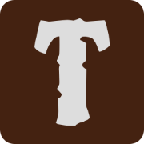

<a id="readme-top"></a>
[![Stargazers][stars-shield]][stars-url]
[![MIT License][license-shield]][license-url]
[![LinkedIn][linkedin-shield]][linkedin-url]


<!-- PROJECT LOGO -->
<br />
<div align="center">
  <a href="https://github.com/PCantarutti/TERMO-AI-CS50">
    
  </a>

<h3 align="center">TERMO A.I GEMINI</h3>

  <p align="center">
    <a href="https://pcantarutti.github.io/TERMO-AI-CS50/">Test project</a>
  </p>
  <p align="center">
    <a href="#">Video Demo here</a>
  </p>
</div>


<!-- ABOUT THE PROJECT -->
## Description

<p align="left">TERMO A.I: The Game That Challenges Your Mind!

Dive into a world of fun and challenge with TERMO A.I, where your task is to guess words related to a theme with the assistance of GEMINI's AI. The game offers a variety of customization options to enhance your experience. On the home screen, you can easily switch between dark and light modes by using the toggle button located in the top right corner, allowing you to play in the style that suits you best. At the center of the screen, you'll find the "Play" button, which launches the game with the default theme and a set of predefined words, ready for you to guess. However, if you're looking for a more personalized experience, you can enter a prompt below to select your own theme. Once you've entered a theme, GEMINI’s AI will generate a list of words based on your request. Sometimes the AI might need a little encouragement, as it doesn’t always generate words on the first attempt—so feel free to submit your prompt multiple times until it gets it right!

When the game begins, you'll be presented with a game screen where you have 6 attempts to guess the correct word. You can type your guesses into the provided input field and submit them. As you input your guesses, feedback will be provided visually: if a letter turns green, it indicates that the letter is in the correct position; if a letter turns yellow, it means the letter is in the word but in a different position; and if the letter remains gray, it’s not part of the word at all. Your goal is to continue guessing until you either solve the word or run out of attempts. The combination of visual clues and careful guesses will push your mind to think critically and strategically.

This game was inspired by another game of the same name, with its development carried out entirely using JavaScript, HTML, and CSS. These technologies were chosen to keep the project simple yet effective, providing a seamless experience without relying on complex or external frameworks.

<details>
  <summary>TIP</summary>
  
  You can access the browser console to know the word beforehand if you want to cheat 
  
</details></p>

[![Product Name Screen Shot][product-screenshot]](https://pcantarutti.github.io/TERMO-AI-CS50/)

<p align="right">(<a href="#readme-top">back to top</a>)</p>


<!-- GETTING STARTED -->
## Getting Started

### gerador_palavras.js (word_generator.js)

The script that handles the user’s prompt input and the interaction with the GEMINI API is central to the gameplay experience. Upon receiving a prompt from the player, the script reaches out to the GEMINI API to generate a list of words that correspond to the chosen theme. To streamline this process and ensure efficiency, the code initially converts a predefined array of words into a JSON file, which is then stored in the browser’s local storage. The decision to use local storage was made to maintain simplicity in the project's structure. By storing the generated words locally, the game can quickly access them without making repeated API calls, ensuring smoother performance. However, the initial intention was to store these generated words in a database. This would have allowed for broader functionality—if another player in the future were to request the same theme, they could simply access the previously generated words without consuming additional API tokens, preserving resources and optimizing the user experience for everyone.

### recuperar_json.js (retrieve_json.js)

Another crucial part of the project is the script responsible for retrieving the previously generated JSON files from local storage. Once the JSON data is recovered, it’s parsed back into an array format. This array is then exported so that it can be used by the main game logic script (table.js) or integrated into other functions like the appearance settings (switch_mode.js), ensuring that the game's state and theme are preserved between different gameplay sessions. By leveraging local storage, this system enables the game to retrieve and handle data dynamically while maintaining the overall flow of the user experience.

### tabela.js (table.js)

The heart of the project lies in the main script, which controls the core mechanics of the game. Here, a random word is selected either from the predefined array of words or from the set generated by GEMINI’s AI based on the user’s theme selection. The main script is also responsible for handling user interactions with the game board. It constantly "listens" for user input, allowing smooth navigation between the input boxes using the space bar, enter key, or directional arrow keys. This gives the player flexibility and ease of use during gameplay. Once all the input boxes are filled, pressing enter on the last box activates the condition function. This function performs the critical task of evaluating the user’s guess, checking if the letters match the hidden word and adjusting the appearance of each letter according to the correct or incorrect positions. The condition function also triggers the animations that highlight correct guesses, giving the user instant feedback.

Before the condition function finishes its execution, it calls another function that uses AJAX to dynamically add a new row of input boxes in the HTML file. This allows the game to continue with a fresh set of inputs, resetting the interface for another round of guessing. The same mechanics are repeated until the user either guesses the correct word or exhausts their available attempts. The careful coordination of these scripts ensures that the game remains interactive and engaging throughout, while the smooth flow of data between functions maintains the integrity of the gameplay experience.

### Prerequisites

To use the project at will, you will first need a GEMINI API key

### Installation

1. Get an API key at [https://aistudio.google.com/app/apikey?hl=pt-br](https://aistudio.google.com/app/apikey)
2. Clone the repository
   ```sh
   git clone https://github.com/PCantarutti/TERMO-AI-CS50.git
   ```

3. Put your API in `gerador_palavras.js`
   ```js
   const API_KEY = 'COLOQUE SUA CHAVE API';
   ```

<p align="right">(<a href="#readme-top">back to top</a>)</p>


<!-- LICENSE -->
## License

Distributed under the MIT License. See `LICENSE.txt` for more information.

<p align="right">(<a href="#readme-top">back to top</a>)</p>


<!-- CONTACT -->
## Contact

Linkedin: [https://www.linkedin.com/in/pedro-cantarutti-3255b2240/](https://www.linkedin.com/in/pedro-cantarutti-3255b2240/)

Project link: [https://github.com/PCantarutti/TERMO-AI-CS50](https://github.com/PCantarutti/TERMO-AI-CS50)

<p align="right">(<a href="#readme-top">back to top</a>)</p>


<!-- MARKDOWN LINKS & IMAGES -->
<!-- https://www.markdownguide.org/basic-syntax/#reference-style-links -->
[contributors-shield]: https://img.shields.io/github/contributors/PCantarutti/Termo-I.A.svg?style=for-the-badge
[contributors-url]: https://github.com/PCantarutti/Termo-I.A/graphs/contributors
[forks-shield]: https://img.shields.io/github/forks/PCantarutti/Termo-I.A.svg?style=for-the-badge
[forks-url]: https://github.com/PCantarutti/Termo-I.A/network/members
[stars-shield]: https://img.shields.io/github/stars/PCantarutti/Termo-I.A.svg?style=for-the-badge
[stars-url]: https://github.com/PCantarutti/Termo-I.A/stargazers
[issues-shield]: https://img.shields.io/github/issues/PCantarutti/Termo-I.A.svg?style=for-the-badge
[issues-url]: https://github.com/PCantarutti/Termo-I.A/issues
[license-shield]: https://img.shields.io/github/license/PCantarutti/Termo-I.A.svg?style=for-the-badge
[license-url]: https://github.com/PCantarutti/Termo-I.A/blob/master/LICENSE
[linkedin-shield]: https://img.shields.io/badge/-LinkedIn-black.svg?style=for-the-badge&logo=linkedin&colorB=555
[linkedin-url]: https://www.linkedin.com/in/pedro-cantarutti-3255b2240
[product-screenshot]: img/screenshot.png
[product-screenshot-2]: img/Screenshot_2.png
[Next.js]: https://img.shields.io/badge/next.js-000000?style=for-the-badge&logo=nextdotjs&logoColor=white
[Next-url]: https://nextjs.org/
[React.js]: https://img.shields.io/badge/React-20232A?style=for-the-badge&logo=react&logoColor=61DAFB
[React-url]: https://reactjs.org/
[Vue.js]: https://img.shields.io/badge/Vue.js-35495E?style=for-the-badge&logo=vuedotjs&logoColor=4FC08D
[Vue-url]: https://vuejs.org/
[Angular.io]: https://img.shields.io/badge/Angular-DD0031?style=for-the-badge&logo=angular&logoColor=white
[Angular-url]: https://angular.io/
[Svelte.dev]: https://img.shields.io/badge/Svelte-4A4A55?style=for-the-badge&logo=svelte&logoColor=FF3E00
[Svelte-url]: https://svelte.dev/
[Laravel.com]: https://img.shields.io/badge/Laravel-FF2D20?style=for-the-badge&logo=laravel&logoColor=white
[Laravel-url]: https://laravel.com
[Bootstrap.com]: https://img.shields.io/badge/Bootstrap-563D7C?style=for-the-badge&logo=bootstrap&logoColor=white
[Bootstrap-url]: https://getbootstrap.com
[JQuery.com]: https://img.shields.io/badge/jQuery-0769AD?style=for-the-badge&logo=jquery&logoColor=white
[JQuery-url]: https://jquery.com 
